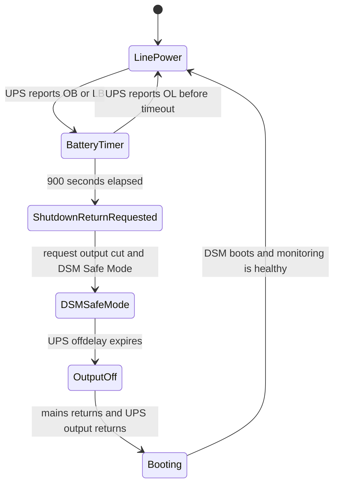

# Synology NUT CH341 UPS

This project makes a Synology DSM NAS work with a USB-attached non-HID UPS that presents as a QinHeng CH340/CH341 serial bridge, commonly visible as USB ID `1a86:7523`.

The target problem:

- DSM's stock USB UPS detection expects a USB HID UPS.
- This UPS is not HID. DSM sees a USB serial bridge, but does not configure it as a UPS.
- There is no off-the-shelf DSM/NUT setup that handles this end-to-end for this device class.
- After mains power is cut from the UPS, DSM should wait 15 minutes, enter Safe/Standby Mode, and shut down cleanly.
- The UPS should cut output shortly after that and wait for mains power to return.
- When mains power returns, the UPS should restore output and the NAS should boot normally.
- DSM notifications, email-capable alerts, and logs should show whether the setup is healthy.

The tested device was a Conceptronic UPS exposing USB `1a86:7523` and speaking a Megatec/Qx-style protocol over serial. The tested NAS platform was Synology Gemini Lake with DSM kernel `4.4.302+`.

## Approach

The setup stays as close as practical to stock DSM:

- DSM's own `nutdrv_qx`, `upsd`, `upsmon`, `upssched`, and `synoups` are used.
- The added kernel module only creates `/dev/ttyUSB*` for the CH341 bridge.
- A DSM service drop-in points the stock UPS USB service at the serial-aware startup path.
- A root-owned watchdog owns the fixed 15-minute power-loss timer.
- A healthcheck timer verifies the setup after boot and after DSM updates, then notifies DSM administrators if it breaks.

No Synology kernel, toolchain archive, GPL source archive, or built kernel module is stored in this repository. The build script downloads Synology dependencies on demand.

## Diagrams




## Build

Run on a Linux machine:

```sh
./scripts/build-ch341-module.sh
```

The output is:

```text
.work/out/ch341.ko
```

The dependency URLs and checksums are in `config/synology-dependencies.env`.

## One-Time DSM Permission Setup

Copy the NAS-side scripts and the built module:

```sh
scp scripts/nas-bootstrap-permissions.sh scripts/synology-ch341-ups-install.sh .work/out/ch341.ko admin@nas:/tmp/
```

Run the bootstrap once:

```sh
ssh admin@nas "sudo INSTALL_USER=admin /bin/sh /tmp/nas-bootstrap-permissions.sh"
```

After this, normal install/check operations can run over SSH through the repository scripts.

## Install Or Update

Run from this repository:

```sh
./scripts/deploy-over-ssh.sh admin@nas
```

Defaults:

- `WAIT_SECONDS=900`
- `UPS_OFF_DELAY_SECONDS=300`
- `UPS_ON_DELAY_SECONDS=180`

Override example:

```sh
WAIT_SECONDS=900 UPS_OFF_DELAY_SECONDS=300 UPS_ON_DELAY_SECONDS=180 ./scripts/deploy-over-ssh.sh admin@nas
```

## DSM Settings

Control Panel -> Hardware & Power -> UPS:

- Enable UPS support.
- UPS type: `USB UPS`.
- Time before Synology NAS enters Standby Mode: `Customize time`, `15 minute(s)`.
- Check `Shut down UPS when the system enters Standby Mode`.
- `Enable network UPS server` is optional.

Control Panel -> Hardware & Power -> General:

- Enable `Restart automatically when power supply issue is fixed`.

## Check

Run:

```sh
./scripts/check-over-ssh.sh admin@nas
```

Expected result:

```text
OK: UPS monitoring is healthy
```

## Test

Short detection test:

1. Run `./scripts/check-over-ssh.sh admin@nas`.
2. Cut mains input to the UPS.
3. Wait 2 minutes.
4. Restore mains input.
5. Run `./scripts/check-over-ssh.sh admin@nas`.

Expected result:

- DSM sends a battery-mode notification.
- DSM sends or logs mains-restored status after power returns.
- The NAS remains online.

Full shutdown test:

1. Charge the UPS enough for the test.
2. Run `./scripts/check-over-ssh.sh admin@nas`.
3. Cut mains input to the UPS.
4. Wait longer than 15 minutes.
5. DSM should enter Safe/Standby Mode.
6. UPS output should cut after the configured off-delay.
7. Restore mains input to the UPS.
8. The NAS should boot after UPS output returns.
9. Run `./scripts/check-over-ssh.sh admin@nas`.

If the check script reports a problem, use [docs/troubleshooting.md](docs/troubleshooting.md).
