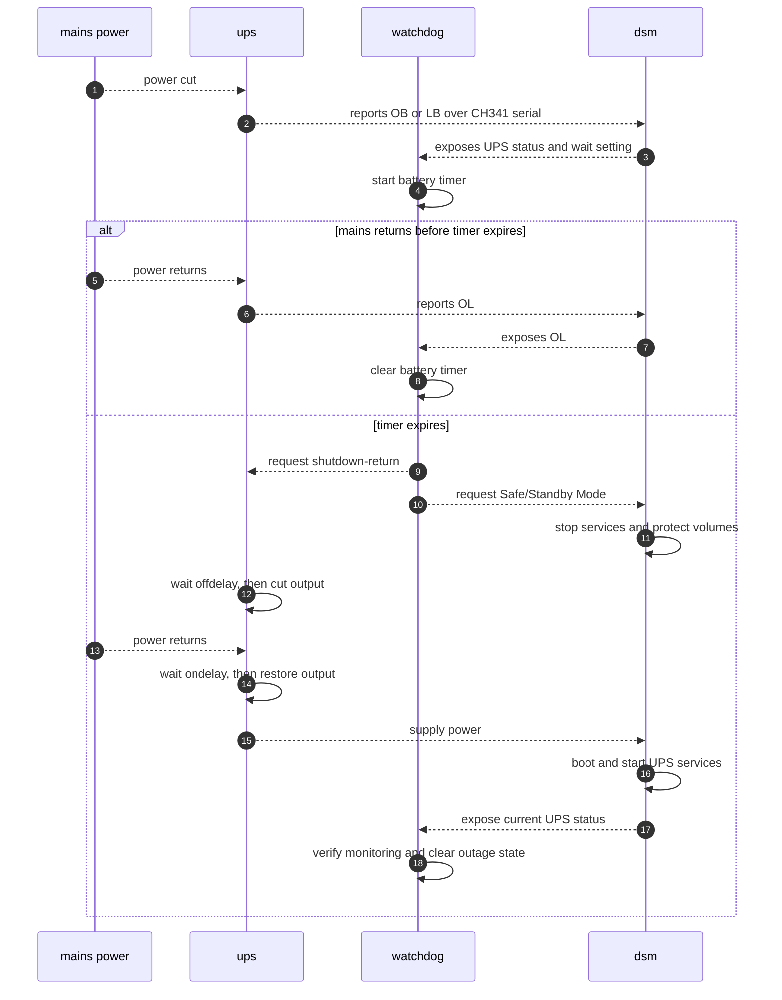
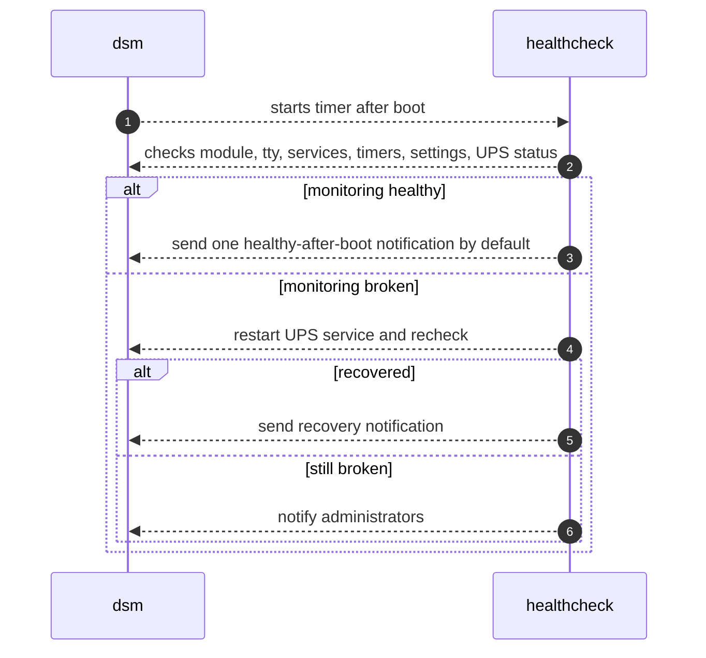

# Synology NUT CH341 UPS

This project makes a Synology DSM NAS work with a USB-attached non-HID UPS that presents as a QinHeng CH340/CH341 serial bridge, commonly visible as USB ID `1a86:7523`.

The tested device was a Conceptronic UPS exposing USB `1a86:7523` and speaking a Megatec/Qx-style protocol over serial. The tested NAS platform was Synology Gemini Lake with DSM kernel `4.4.302+`.

## Problem

- DSM's stock USB UPS detection expects USB HID.
- This UPS is not HID; DSM sees a USB serial bridge, but does not configure it as a UPS.
- There is no off-the-shelf DSM/NUT setup that handles this end-to-end for this device class.
- After mains power is cut, DSM should wait for the configured UPS wait time, enter Safe/Standby Mode, ask the UPS to cut output, and later boot normally when UPS output returns.
- DSM notifications and logs should show whether monitoring is healthy.

## Solution Architecture

The setup stays as close as practical to stock DSM:

- DSM's own `nutdrv_qx`, `upsd`, `upsmon`, `upssched`, and `synoups` are used.
- The added kernel module only creates `/dev/ttyUSB*` for the CH341 bridge.
- A DSM service drop-in points the stock UPS USB service at the serial-aware startup path.
- A watchdog timer runs the DSM-configured power-loss decision loop shown below.
- A healthcheck timer verifies the installed setup after boot and after DSM updates. It notifies DSM administrators if monitoring breaks, but it is not part of the power-loss sequence.

### Build/Deploy Path

- `dependencies.env` selects the Synology GPL kernel source, Synology toolchain, checksums, and DSM platform.
- `make deps` downloads the configured source/toolchain archives to the local build workspace.
- `make build` builds only `ch341.ko`; it does not build or replace the DSM kernel.
- `make bootstrap` and `make install` copy `ch341.ko` and the installer to DSM over SSH.
- DSM loads `ch341.ko` from `/usr/local`, gets `/dev/ttyUSB*`, then uses the stock NUT stack against that serial TTY.

### DSM Runtime

#### Boot Hook

- `ch341-ups.service` is enabled under `syno-bootup-done.target`; it restarts DSM's `ups-usb.service` after DSM finishes booting.
- The `ups-usb.service` drop-in starts DSM's stock NUT processes through the serial-aware wrapper.

#### Watchdog

- The watchdog is a DSM systemd timer, not a separate always-running process.
- It uses DSM's UPS/NUT status to detect prolonged battery mode and trigger the Safe/Standby shutdown path shown in the outage sequence.
- It reads DSM's UPS wait time and UPS-output-shutdown setting at runtime, so UI changes are used without reinstalling.

#### Healthcheck

- The healthcheck is also a DSM systemd timer, not a separate always-running process.
- `ch341-ups-healthcheck.timer` runs 5 minutes after boot and every 15 minutes after that. It checks the module, TTY, DSM service wiring, timers, NUT processes, DSM UPS settings, and live UPS status as shown in the monitoring sequence.
- It sends one healthy-after-boot notification by default, sends problem notifications if monitoring breaks, and sends a recovery notification when monitoring becomes healthy again.

### Outage Sequence



### Monitoring Sequence



## Implementation

### Prepare

Run the Make targets on a Linux host, including WSL on Windows. The NAS does not need this repository, the Synology source archive, or the toolchain. Deployment uses SSH and copies only the installer and built module to the NAS.

#### Parameters

Set local parameters:

```sh
export DSM_USER=admin
export NAS="$DSM_USER@nas"
export WAIT_SECONDS=900
export UPS_OFF_DELAY_SECONDS=300
export UPS_ON_DELAY_SECONDS=180
```

- `NAS` is the SSH target used by `bootstrap`, `install`, and `check`.
- `DSM_USER` is the DSM account authorized by `bootstrap`; normally it is the user part of `NAS`.
- `WAIT_SECONDS` is only the initial DSM UPS wait time written during install. Later UI changes are respected.
- `UPS_OFF_DELAY_SECONDS` and `UPS_ON_DELAY_SECONDS` configure UPS output cutoff/restore delays.
- `HEALTH_NOTIFY_OK_ON_BOOT` controls the DSM success notification after the first healthy timer run after boot. Default: `yes`.
  - To disable that notification after install, rerun `make install HEALTH_NOTIFY_OK_ON_BOOT=no`. No module rebuild is needed.
- `MODULE` points to the built `ch341.ko` if it is not in the default build location.
- `DEPS_FILE` points to the explicit Synology dependency configuration. Default: `dependencies.env`.
- `WORK_DIR` is the local download/build workspace. Default: `./.work/build`.

The Makefile and scripts document the exact variables they accept.

#### SSH

Verify SSH:

```sh
ssh "$NAS" true
```

#### DSM Settings

Set general DSM options:

- Control Panel -> Hardware & Power -> General: enable `Restart automatically when power supply issue is fixed`.
- Control Panel -> Notification -> Email: configure email delivery if email alerts are required.

UPS options after install:

- Control Panel -> Hardware & Power -> UPS -> Enable UPS support: enabled.
- UPS type: `USB UPS`.
- Time before Synology NAS enters Standby Mode: `Customize time`; default install value is 15 minutes.
- `Shut down UPS when the system enters Standby Mode`: checked if the UPS should cut output after DSM enters Safe/Standby Mode.
- `Until low battery`: not recommended for this UPS class because battery/runtime reporting is not reliable enough for the shutdown policy.

The watchdog reads DSM's UPS wait time and UPS-output-shutdown setting at runtime. Changing those two UI settings does not require reinstalling.

### Build

Inspect `dependencies.env` first. It declares the Synology kernel source archive, toolchain archive, checksums, and platform name.

Download the configured dependencies:

```sh
make deps
```

Build the module from the already-downloaded dependencies:

```sh
make build
```

For another platform or source set, edit `dependencies.env` or set `DEPS_FILE` to another file with the same variables.

### Install

#### Bootstrap

Prepare DSM permissions once:

```sh
make bootstrap
```

This copies the NAS-side installer and module to `/tmp` over SSH, then runs one `sudo` command on DSM. If DSM asks for the sudo password, enter it in the local terminal. No manual shell work on the NAS is required.

It installs a root-owned apply command and a sudoers entry for the chosen `DSM_USER`, so later `make install` and `make check` can run without prompts.

#### Apply

Install or update the UPS setup:

```sh
make install
```

Override install parameters when needed:

```sh
make install WAIT_SECONDS=900 UPS_OFF_DELAY_SECONDS=300 UPS_ON_DELAY_SECONDS=180 HEALTH_NOTIFY_OK_ON_BOOT=yes
```

### Check

```sh
make check
```

`make check` is a manual DSM runtime health report over SSH. Ongoing monitoring is handled by the DSM healthcheck timer installed on the NAS.

It verifies:

- installed healthcheck result
- CH341 kernel module and `/dev/ttyUSB*`
- NUT driver, server, and monitor processes
- DSM UPS services and timers
- DSM UPS wait time and output-shutdown setting
- live DSM and NUT UPS status

Expected final line:

```text
UPS monitoring: PASS
```

### Test

#### Short Detection

1. Run `make check`.
2. Cut mains input to the UPS.
3. Wait 2 minutes.
4. Restore mains input.
5. Run `make check` again.

Expected:

- DSM sends a battery-mode notification.
- DSM sends or logs mains-restored status after power returns.
- NAS remains online.

#### Full Shutdown

1. Charge the UPS enough for the test.
2. Run `make check`.
3. Cut mains input to the UPS.
4. Wait longer than the configured DSM UPS wait time.
5. DSM enters Safe/Standby Mode.
6. UPS output cuts after the configured off-delay.
7. Restore mains input to the UPS.
8. UPS output returns after the configured on-delay.
9. NAS boots.
10. Run `make check` again.

If the check reports a problem, use [TROUBLESHOOTING.md](TROUBLESHOOTING.md).
