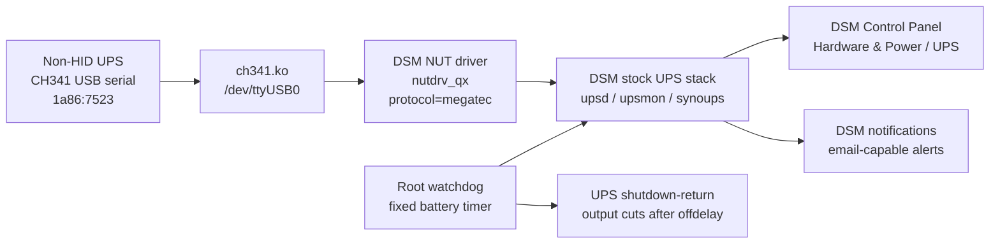
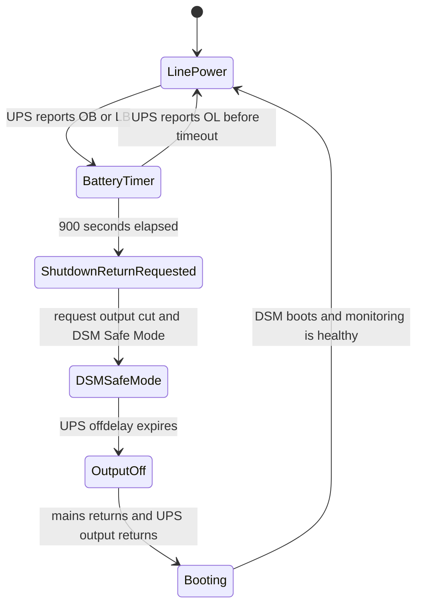

# Synology NUT CH341 UPS

This project makes a Synology DSM NAS work with a USB-attached non-HID UPS that presents as a QinHeng CH340/CH341 serial bridge, commonly visible as USB ID `1a86:7523`.

The problem it targets:

- A Synology NAS is attached to a non-HID UPS.
- DSM's stock USB UPS page does not detect the UPS as a normal HID UPS.
- There is no off-the-shelf DSM/NUT setup for this exact path: the UPS is not USB HID, and DSM's normal USB UPS autodetection does not create the serial TTY or configure `nutdrv_qx`.
- After mains power is cut from the UPS, the NAS must wait for a configured period, then shut itself down gracefully.
- The UPS must cut output shortly after DSM enters Safe/Standby Mode and wait for mains power to return.
- When mains power returns, the UPS must restore output and the NAS must boot normally.
- Diagnostics must exist through DSM notifications, email-capable alerts, and logs.
- The solution should rely on stock DSM services and NUT tools as much as possible.

The tested device was a Conceptronic UPS that exposes USB `1a86:7523` and speaks a Megatec/Qx-style protocol over serial. The tested NAS platform was Synology Gemini Lake with DSM kernel `4.4.302+`.

## What This Does

This is not a containerized replacement UPS stack. It keeps DSM's UPS path in use and adds the minimum host pieces needed for a CH341 serial UPS:

- A locally built `ch341.ko` module matching the DSM kernel.
- A boot hook that loads `ch341.ko`, waits for `/dev/ttyUSB*`, and starts DSM's stock `nutdrv_qx`, `upsd`, and `upsmon`.
- DSM UPS config for `nutdrv_qx` with `protocol = megatec`.
- A root watchdog that owns the 15-minute battery timer and triggers DSM Safe/Standby Mode plus UPS output shutdown.
- A healthcheck timer that verifies the setup after boot and after DSM updates, then sends DSM notifications if it breaks.

No Synology kernel, Synology toolchain archive, GPL source archive, or built kernel module is stored in this repository. Those are dependencies or generated artifacts.

## Architecture





## Install Summary

Build the module on a Linux machine with access to the Synology GPL source and toolchain:

```sh
./scripts/build-ch341-module.sh
```

Copy the installer and generated module to the NAS:

```sh
scp scripts/synology-ch341-ups-install.sh .work/out/ch341.ko admin@nas:/tmp/
```

Install on the NAS as root:

```sh
ssh admin@nas
sudo -i
/bin/sh /tmp/synology-ch341-ups-install.sh install
```

Useful environment overrides:

```sh
WAIT_SECONDS=900 UPS_OFF_DELAY_SECONDS=300 UPS_ON_DELAY_SECONDS=180 /bin/sh /tmp/synology-ch341-ups-install.sh install
DOC_USER=admin /bin/sh /tmp/synology-ch341-ups-install.sh install
```

## DSM Settings

Control Panel -> Hardware & Power -> UPS:

- Enable UPS support.
- UPS type: `USB UPS`.
- Time before Synology NAS enters Standby Mode: `Customize time`, `15 minute(s)`.
- Check `Shut down UPS when the system enters Standby Mode`.
- `Enable network UPS server` is optional and not required for this setup.

Control Panel -> Hardware & Power -> General:

- Enable `Restart automatically when power supply issue is fixed`.

## Verify

On the NAS:

```sh
/usr/syno/bin/synoups status
/usr/bin/upsc ups@localhost ups.status
/usr/local/sbin/ch341-ups-healthcheck.sh; echo rc=$?
systemctl is-active ch341-ups-watchdog.timer
systemctl is-enabled ch341-ups-watchdog.timer
```

Expected normal status:

- `synoups status` returns `OL`.
- `upsc ups@localhost ups.status` returns `OL`.
- The healthcheck exits with `rc=0`.
- `ch341-ups.service`, `ch341-ups-healthcheck.timer`, and `ch341-ups-watchdog.timer` are enabled.

See [docs/testing.md](docs/testing.md) for the power-loss test plan.

## Unattended SSH Operation

The first bootstrap needs a root-capable action on DSM. For later no-prompt SSH runs, install the script at a fixed root-owned path and grant passwordless sudo only for that exact command. See [docs/installing.md](docs/installing.md#unattended-ssh-install).
