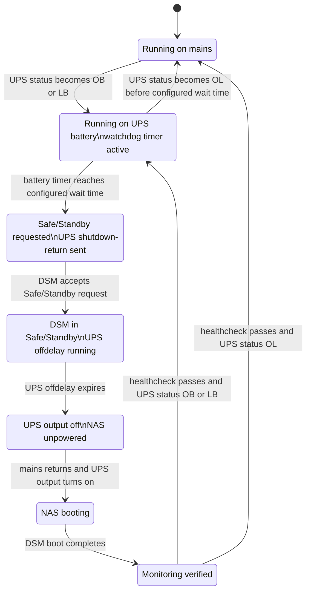

# Synology NUT CH341 UPS

This project makes a Synology DSM NAS work with a USB-attached non-HID UPS that presents as a QinHeng CH340/CH341 serial bridge, commonly visible as USB ID `1a86:7523`.

The target problem:

- DSM's stock USB UPS detection expects a USB HID UPS.
- This UPS is not HID. DSM sees a USB serial bridge, but does not configure it as a UPS.
- There is no off-the-shelf DSM/NUT setup that handles this end-to-end for this device class.
- After mains power is cut from the UPS, DSM should wait for its configured UPS wait time (default 15 minutes), enter Safe/Standby Mode, and shut down cleanly.
- The UPS should cut output shortly after that and wait for mains power to return.
- When mains power returns, the UPS should restore output and the NAS should boot normally.
- DSM notifications, email-capable alerts, and logs should show whether the setup is healthy.

The tested device was a Conceptronic UPS exposing USB `1a86:7523` and speaking a Megatec/Qx-style protocol over serial. The tested NAS platform was Synology Gemini Lake with DSM kernel `4.4.302+`.

## Approach

The setup stays as close as practical to stock DSM:

- DSM's own `nutdrv_qx`, `upsd`, `upsmon`, `upssched`, and `synoups` are used.
- The added kernel module only creates `/dev/ttyUSB*` for the CH341 bridge.
- A DSM service drop-in points the stock UPS USB service at the serial-aware startup path.
- A root-owned watchdog owns the DSM-configured power-loss timer.
- A healthcheck timer verifies the setup after boot and after DSM updates, then notifies DSM administrators if it breaks.

No Synology kernel, toolchain archive, GPL source archive, or built kernel module is stored in this repository. The build script downloads Synology dependencies on demand.

## Diagrams




## Build

Run on a Linux machine:

```sh
./scripts/build-ch341-module.sh
```

The output is:

```text
.work/out/ch341.ko
```

The dependency URLs and checksums are in `config/synology-dependencies.env`.

Set the NAS target once:

```sh
DSM_USER=admin
NAS="$DSM_USER@nas"
```

## One-Time DSM Permission Setup

Copy the NAS-side scripts and the built module:

```sh
scp scripts/nas-bootstrap-permissions.sh scripts/synology-ch341-ups-install.sh .work/out/ch341.ko "${NAS}:/tmp/"
```

Run the bootstrap once:

```sh
ssh "$NAS" "sudo INSTALL_USER=$DSM_USER /bin/sh /tmp/nas-bootstrap-permissions.sh"
```

After this, normal install/check operations can run over SSH through the repository scripts.

## Install Or Update

Run from this repository:

```sh
./scripts/deploy-over-ssh.sh "$NAS"
```

Defaults:

- `WAIT_SECONDS=900` (deploy default; writes the initial DSM UPS wait time)
- `UPS_OFF_DELAY_SECONDS=300`
- `UPS_ON_DELAY_SECONDS=180`

Changing the wait time later in DSM's UPS UI is respected by the watchdog; no reinstall is needed.

Override example:

```sh
WAIT_SECONDS=900 UPS_OFF_DELAY_SECONDS=300 UPS_ON_DELAY_SECONDS=180 ./scripts/deploy-over-ssh.sh "$NAS"
```

## DSM Settings

The installer sets the defaults below. After install, DSM remains the source for the wait time and UPS-output-shutdown choice.

Control Panel -> Hardware & Power -> UPS:

- Enable UPS support: must stay enabled. If disabled, the watchdog logs that it is inactive and does not force shutdown behavior.
- UPS type: keep `USB UPS`. Other DSM UPS types are not part of this serial-bridge setup.
- Time before Synology NAS enters Standby Mode: use `Customize time`. The watchdog reads this DSM value at runtime. The deploy default is 15 minutes.
- `Until low battery`: not recommended for this UPS class because battery charge/runtime/low-battery reporting is not reliable enough for the shutdown policy.
- `Shut down UPS when the system enters Standby Mode`: respected at runtime. If unchecked, DSM can enter Safe/Standby Mode, but the script skips the UPS output-cut command.
- `Enable network UPS server`: optional; not required by this setup.

Control Panel -> Hardware & Power -> General:

- Enable `Restart automatically when power supply issue is fixed`.

## Check

Run:

```sh
./scripts/check-over-ssh.sh "$NAS"
```

The script reports:

- installed healthcheck result
- CH341 kernel module and serial TTY
- NUT driver/server/monitor processes
- DSM UPS services and timers
- DSM UPS wait time and output-shutdown setting
- live DSM and NUT UPS status

It ends with:

```text
RESULT: PASS - UPS monitoring is healthy
```

## Test

Short detection test:

1. Run the check script.
2. Cut mains input to the UPS.
3. Wait 2 minutes.
4. Restore mains input.
5. Run the check script again.

Expected result:

- DSM sends a battery-mode notification.
- DSM sends or logs mains-restored status after power returns.
- The NAS remains online.

Full shutdown test:

1. Charge the UPS enough for the test.
2. Run the check script.
3. Cut mains input to the UPS.
4. Wait longer than the configured DSM UPS wait time (15 minutes by default).
5. DSM should enter Safe/Standby Mode.
6. UPS output should cut after the configured off-delay.
7. Restore mains input to the UPS.
8. The NAS should boot after UPS output returns.
9. Run the check script again.

If the check script reports a problem, use [TROUBLESHOOTING.md](TROUBLESHOOTING.md).
