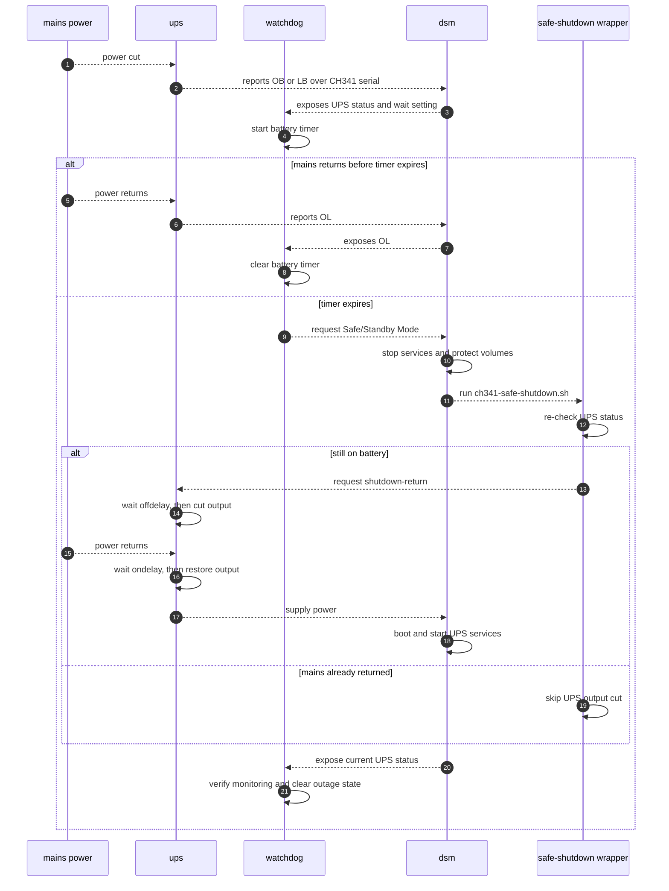
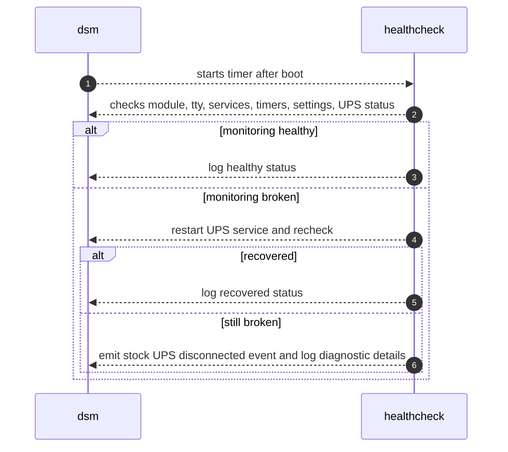

# Synology NUT CH341 UPS

This project makes a Synology DSM NAS work with a USB-attached non-HID UPS that presents as a QinHeng CH340/CH341 serial bridge, commonly visible as USB ID `1a86:7523`.

The tested device was a Conceptronic UPS exposing USB `1a86:7523` and speaking a Megatec/Qx-style protocol over serial. The tested NAS platform was Synology Gemini Lake with DSM kernel `4.4.302+`.

## Problem

- DSM's stock USB UPS detection expects USB HID.
- This UPS is not HID; DSM sees a USB serial bridge, but does not configure it as a UPS.
- There is no off-the-shelf DSM/NUT setup that handles this end-to-end for this device class.
- After mains power is cut, DSM should wait for the configured UPS wait time, enter Safe/Standby Mode, ask the UPS to cut output, and later boot normally when UPS output returns.
- DSM notifications and logs should show whether monitoring is healthy.

## Solution Architecture

The setup stays as close as practical to stock DSM:

- DSM's own `nutdrv_qx`, `upsd`, `upsmon`, `upssched`, and `synoups` are used.
- The added `ch341.ko` module is loaded from `/usr/local`, creates `/dev/ttyUSB*` for the CH341 bridge, and leaves UPS monitoring to the stock NUT stack over that serial TTY.
- A DSM service drop-in points the stock UPS USB service at the serial-aware startup path.
- A watchdog timer runs the DSM-configured power-loss decision loop shown below.
- The Safe/Standby shutdown path re-checks live UPS status before any UPS output-cut command.
- A healthcheck timer verifies the installed setup after boot and after DSM updates. It uses DSM's stock Power supply events for user-visible notifications, but it is not part of the power-loss sequence.

### DSM Runtime

#### Boot Hook

- `ch341-ups.service` is enabled under `syno-bootup-done.target`; it restarts DSM's `ups-usb.service` after DSM finishes booting.
- The `ups-usb.service` drop-in starts DSM's stock NUT processes through the serial-aware wrapper.

#### Watchdog

- The watchdog is a DSM systemd timer, not a separate always-running process.
- It uses DSM's UPS/NUT status to detect prolonged battery mode and trigger the Safe/Standby shutdown path shown in the outage sequence.
- It reads DSM's UPS wait time at runtime. It does not send the UPS output-cut command.

#### Safe-Shutdown Wrapper

- `ch341-safe-shutdown.sh` is installed as a drop-in replacement for Synology's `safe-shutdown.service` command.
- It runs late in DSM's Safe/Standby shutdown path, after DSM has started stopping services and protecting volumes.
- It refreshes the serial UPS stack, reads DSM's UPS-output-shutdown setting, re-checks live UPS status, and only calls `synoups shutdownups` if the UPS is still `OB` or `LB`.

#### Healthcheck

- The healthcheck is also a DSM systemd timer, not a separate always-running process.
- `ch341-ups-healthcheck.timer` runs 5 minutes after boot and every 15 minutes after that. It checks the module, TTY, DSM service wiring, timers, NUT processes, DSM UPS settings, and live UPS status as shown in the monitoring sequence.
- UPS monitoring connect/recovery emits DSM's stock `The UPS has been connected` event.
- If monitoring is still unavailable after an automatic restart attempt, the healthcheck emits DSM's stock `The UPS has been disconnected` event and logs the diagnostic details.

### Outage Sequence



### Monitoring Sequence



## Implementation

### Prepare

Run the Make targets on a Linux host, including WSL on Windows. The NAS does not need this repository, the Synology source archive, or the toolchain. Deployment uses SSH and copies only the installer and built module to the NAS.

#### Solution Parameters

Set local parameters:

```sh
export DSM_USER=admin
export NAS=nas
export WAIT_SECONDS=900
export UPS_OFF_DELAY_SECONDS=300
export UPS_ON_DELAY_SECONDS=180
```

- `NAS` is only the NAS hostname or SSH host alias used by `install`, `check`,
  and `probe`.
- `DSM_USER` is the DSM account used for SSH login and sudo authorization.
- `WAIT_SECONDS` is the default DSM UPS wait time used only if DSM has no valid saved setting. Later UI changes are respected.
- `UPS_OFF_DELAY_SECONDS` and `UPS_ON_DELAY_SECONDS` configure UPS output cutoff/restore delays.

#### Passwordless Access Configuration (Mandatory)

The install flow is intentionally noninteractive. Configure SSH, DSM sudo, and
DSM notification delivery before running `make install`; interactive password
prompts are not part of the documented flow.

##### SSH Authentication

Configure SSH so the local build machine can connect to DSM without prompts:

- Enable the DSM SSH service.
- Make the local machine trust the NAS host key.
- Install the local SSH public key for the DSM account.
- Load any SSH key passphrase into `ssh-agent`, or use an unencrypted automation
  key if that matches your security policy.

This command must exit without any prompt:

```sh
ssh -o BatchMode=yes "$DSM_USER@$NAS" true
```

##### DSM Sudo

The DSM account must be allowed to run this repository's install/check/probe
commands through sudo without a password. Run this once after setting the
solution parameters; it replaces this repository's sudoers file with the current
rule:

```sh
setup_script="/tmp/synology-nut-ch341-ups-sudoers-setup.$$.sh"
ssh "$DSM_USER@$NAS" "cat > '$setup_script' && chmod 700 '$setup_script'" <<'EOF'
set -eu
DSM_USER="$1"
SETUP_SCRIPT="$2"

case "$DSM_USER" in
	""|*[!A-Za-z0-9._-]*)
		printf 'ERROR: invalid DSM_USER for sudoers rule: %s\n' "$DSM_USER" >&2
		exit 2
		;;
esac

sudoers=/etc/sudoers.d/synology-nut-ch341-ups
tmp="${sudoers}.tmp"

cat > "$tmp" <<EORULE
$DSM_USER ALL=(root) NOPASSWD: /bin/true, /bin/sh /tmp/synology-ch341-ups-install.sh *, /usr/local/sbin/ch341-ups-healthcheck.sh, /usr/local/sbin/ch341-ups.sh status, /usr/syno/bin/synogetkeyvalue /usr/syno/etc/ups/synoups.conf ups_wait_time, /usr/syno/bin/synogetkeyvalue /usr/syno/etc/ups/synoups.conf ups_safeshutdown, /usr/syno/bin/synoups status, /bin/sh /tmp/probe-nas-ups.sh
EORULE

chmod 0440 "$tmp"
mv "$tmp" "$sudoers"
chmod 0440 "$sudoers"
rm -f "$SETUP_SCRIPT"
EOF

ssh -tt "$DSM_USER@$NAS" "sudo /bin/sh '$setup_script' '$DSM_USER' '$setup_script'; rc=\$?; rm -f '$setup_script'; exit \$rc"
```

Then test the installed rule with an actual passwordless sudo command. This
must exit without a password prompt:

```sh
ssh "$DSM_USER@$NAS" sudo -n /bin/true
```

#### DSM Settings

##### General DSM Options

- Control Panel -> Hardware & Power -> General: enable `Restart automatically when power supply issue is fixed`.
- Control Panel -> Notification -> Email: configure and test email delivery.

##### DSM Notification Rule

DSM decides which stock events are sent by email from Control Panel notification
rules. Before relying on remote UPS alerts, configure the email-enabled rule:

1. Open Control Panel -> Notification -> Rules.
2. Select the rule that has your email address in the Email column, for example
   `default`, and click Edit.
3. Expand Power System or Power supply.
4. Tick all events that you want to be notified about:
   - Info: `The UPS has been connected`
   - Critical: `The UPS has been disconnected`
   - Warning: `The UPS has entered battery mode`
   - Warning: `The UPS has reached low battery`
   - Info: `The UPS has returned to AC mode`
5. Save the rule and click Apply.

The installer does not change DSM Notification Rule membership. Configure these
checkboxes in DSM UI; the installer always emits the stock UPS events, and DSM
rules decide which delivery channels receive them.

##### DSM UPS Options

- Control Panel -> Hardware & Power -> UPS -> Enable UPS support: enabled.
- UPS type: `USB UPS`.
- Time before Synology NAS enters Standby Mode: `Customize time`; the fallback default is 15 minutes only when DSM has no valid saved setting.
- `Shut down UPS when the system enters Standby Mode`: checked if the UPS should cut output after DSM enters Safe/Standby Mode.
- `Until low battery`: not recommended for this UPS class because battery/runtime reporting is not reliable enough for the shutdown policy.

The watchdog reads DSM's UPS wait time at runtime. `ch341-safe-shutdown.sh`, installed under `safe-shutdown.service`, reads the UPS-output-shutdown setting and re-checks that the UPS is still on battery before asking the UPS to cut output. Changing those two UI settings does not require reinstalling.

### Build And Install

Inspect `dependencies.env` first. It declares the Synology kernel source archive, toolchain archive, checksums, and platform name.

Download the configured dependencies:

```sh
make deps
```

Build the module from the already-downloaded dependencies:

```sh
make build
```

Install or update the UPS setup:

```sh
make install
```

### Normal Notifications

- UPS monitoring connect/recovery: UPS-connected event.
- Mains input loss: battery-mode event.
- Mains input restored: AC-return event.
- Low battery: low-battery event.
- UPS disconnected/unavailable: UPS-disconnected event.
- DSM UPS settings changes are settings changes only; when monitoring is already healthy, they preserve the already-running UPS monitor instead of restarting it.
- Power-state events use the single DSM-facing path: `upsmon EXEC -> upssched -> wrapper -> synoups -> DSM stock UPS event`.
- `SYSLOG`/`WALL` are not enabled for those events on DSM, because they can create duplicate DSM notifications outside the `synoups` path.
- The last observed power state is kept in `/run/ch341-ups-power.state` across service restarts; it resets on NAS boot.

### Testing

#### Check

```sh
make check
```

`make check` is a manual DSM runtime health report over SSH. Ongoing monitoring is handled by the DSM healthcheck timer installed on the NAS.

It verifies:

- installed healthcheck result
- CH341 kernel module and `/dev/ttyUSB*`
- NUT driver, server, and monitor processes
- DSM UPS services and timers
- installed DSM/NUT event wiring for the five stock UPS events
- DSM UPS wait time and output-shutdown setting
- live DSM and NUT UPS status

Expected final line:

```text
UPS monitoring: PASS
```

#### Short Detection

1. Run `make check`.
2. Cut mains input to the UPS.
3. Wait 2 minutes.
4. Restore mains input.
5. Run `make check` again.

Expected:

- DSM sends a battery-mode notification (if configured).
- DSM sends the return-to-AC notification after power returns (if configured).
- NAS remains online.

#### Full Shutdown

1. Charge the UPS enough for the test.
2. Run `make check`.
3. Cut mains input to the UPS.
4. Wait longer than the configured DSM UPS wait time.
5. DSM enters Safe/Standby Mode.
6. If UPS status is still `OB` or `LB` when `safe-shutdown.service` runs `ch341-safe-shutdown.sh`, UPS output cuts after the configured off-delay.
7. Restore mains input to the UPS.
8. UPS output returns after the configured on-delay.
9. NAS boots.
10. DSM sends the UPS-connected notification after the UPS stack starts (if configured).
11. Run `make check` again.

If the check reports a problem, use [TROUBLESHOOTING.md](TROUBLESHOOTING.md).
